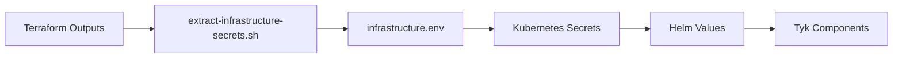

# Tyk Control Plane Deployment Playbook

A deployment playbook for Tyk API Management using infrastructure-as-code practices.

## What This Provides

Initially, we are focussing on Azure, however there are plans to extend this to EKS and GKE also.

- **Complete Infrastructure**: Azure Kubernetes Service (AKS), PostgreSQL, Redis with Terraform
- **Automated Secret Management**: Terraform outputs → Kubernetes secrets → Helm values
- **Production-Ready Components**: Dashboard, Gateway, MDCB, Pump, Developer Portal, Tyk Operator
- **One-Command Deployment**: Infrastructure to running Control Plane in minutes
- **Extensible Foundation**: Configurable for customer requirements

## Quick Start

### Prerequisites
- Azure CLI installed and configured (`az login`)
- Terraform >= 1.0
- kubectl installed
- Helm 3.x installed

### Complete Deployment (5 minutes)
```bash
# 1. Deploy everything (infrastructure + Tyk Control Plane)
make fresh-deploy

# 2. Check deployment status
make status

# 3. Get access information
kubectl get services -n tyk
```

## Components Deployed

### Infrastructure (Terraform)
- **AKS Cluster**: Kubernetes cluster for running Tyk components
- **PostgreSQL Flexible Server**: Database for Tyk Dashboard and Portal
- **Redis Cache**: Session storage and rate limiting
- **Virtual Network**: Security-focused subnet configuration

### Tyk Components (Helm)
- **Tyk Dashboard**: API management interface
- **Tyk Gateway**: API Gateway for control plane
- **Tyk MDCB**: Multi-Data Center Bridge for data plane management
- **Tyk Pump**: Analytics data processor
- **Tyk Developer Portal**: API developer portal
- **Tyk Operator**: Kubernetes-native API Management

## Complete Workflow

### 1. Infrastructure Deployment
```bash
cd terraform/deployments/control-plane/azure
terraform init
terraform apply -var-file="examples/dev.tfvars"
```

### 2. Extract Infrastructure Secrets
```bash
# Extracts Terraform outputs to Kubernetes configuration
./scripts/extract-infrastructure-secrets.sh
```

### 3. Setup Kubernetes Prerequisites
```bash
# Installs cert-manager, creates namespaces, adds Helm repositories
./scripts/setup-cluster-prerequisites.sh
```

### 4. Deploy Tyk Control Plane
```bash
# Deploys all Tyk components with proper secret management
./scripts/deploy-tyk-control-plane.sh
```

## Secret Management Flow



1. **Terraform** outputs database and Redis connection details
2. **Extract script** creates `infrastructure.env` with connection strings
3. **Deploy script** creates Kubernetes secrets from environment variables
4. **Helm charts** consume secrets via environment variables
5. **Tyk components** use the secrets for database and Redis connections

## Available Commands

```bash
# Complete fresh deployment
make fresh-deploy

# Individual steps
make setup-prerequisites    # Setup cluster prerequisites
make deploy                # Deploy Tyk Control Plane only

# Monitoring
make status                # Check deployment status
make logs-all             # View logs from all components
make logs-dashboard       # Dashboard logs only
make logs-mdcb           # MDCB logs only
make logs-portal         # Portal logs only
```

## Configuration

### Environment Examples
- `terraform/deployments/control-plane/azure/examples/dev.tfvars` - Development environment
- `terraform/deployments/control-plane/azure/examples/staging.tfvars` - Staging environment  
- `terraform/deployments/control-plane/azure/examples/prod.tfvars` - Production environment

### Customization Points
- **Infrastructure sizing**: Modify `*.tfvars` files
- **Tyk configuration**: Edit `kubernetes/tyk-control-plane/values.yaml`
- **Licenses**: Update `kubernetes/tyk-control-plane/.env`

## Connecting Data Planes

After deployment, connect Tyk Data Planes using:

```bash
# Get connection details
kubectl get services -n tyk

# MDCB connection endpoint
MDCB_ENDPOINT=$(kubectl get service mdcb-svc-tyk-cp-tyk-mdcb -n tyk -o jsonpath='{.status.loadBalancer.ingress[0].ip}'):9091
```

## Documentation

- [Complete Deployment Playbook](docs/deployment-playbook.md) - Detailed step-by-step guide
- [Architecture Overview](docs/tyk-control-plane-deployment.md) - Component relationships
- [Terraform Guide](docs/terraform/deployment-guide.md) - Infrastructure deployment details

## Cleanup

```bash
# Remove Tyk Control Plane
helm uninstall tyk-cp -n tyk

# Destroy infrastructure
cd terraform/deployments/control-plane/azure
terraform destroy -var-file="examples/dev.tfvars"
```
